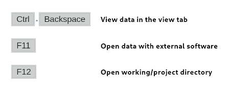

# quickview

<!-- badges: start -->
<!-- badges: end -->

The goal of quickview is to quickly inspect your data in a View tab of RStudio. Unlike the default inspector (F2), quickview shows the result of the current selection or the result of the current line.

Additionally, quickview allows to open your data in your favorite software. Currently dataframes, matrices and vectors with more than one element will be open with your default CSV viewer. Vector of length one will be open directly in your default text editor.

Finally quickview provides a quick command to open your working directory directly with your file manager. This action is available in the RStudio file manager, but cannot be easily called with a keyboard shortcut.

*Features*

 - Run complete active line(s) or current selection
 - Works with pipes

## Installation

You can install quickview from GitHub with remotes:

``` r
remotes::install_github("fkeck/quickview")
```
Restart RStudio. That's it.

Then you will probably want to assign keyboard shortcuts to the quickview commands. In RStudio use Tools > Addins > Browse Addins > Keyboard shortcuts.

I use Ctrl + Backspace (for View tab, see example below), F11 (to open the data) and F12 (for the working directory).



## Example

This example shows how quickview can be used to view data in the View tab and demonstrate the support for selection and pipes.


Here are some example of R commands and how you may expect their result to be opened in external software:

