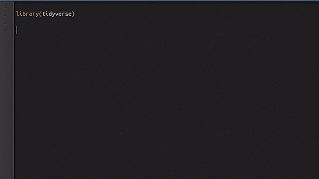

# quickview

<!-- badges: start -->
<!-- badges: end -->

The goal of quickview is to quickly inspect your data in a View tab of RStudio. Unlike the default inspector (F2), quickview show the result of the current selection or the result of the current line.

*Features*

 - Run complete line(s) or selection and view the result 
 - Works with any object supported by the RStudio View pane
 - Works with pipes

## Installation

You can install quickview from GitHub with devtools:

``` r
devtools::install_github("fkeck/quickview")
```
Then you will probably want to assign a keyboard shortcut to the quickview command. In RStudio use Tools > Addins > Browse Addins > Keyboard shortcuts.

I like Ctrl + Backspace (see example below).

## Example


